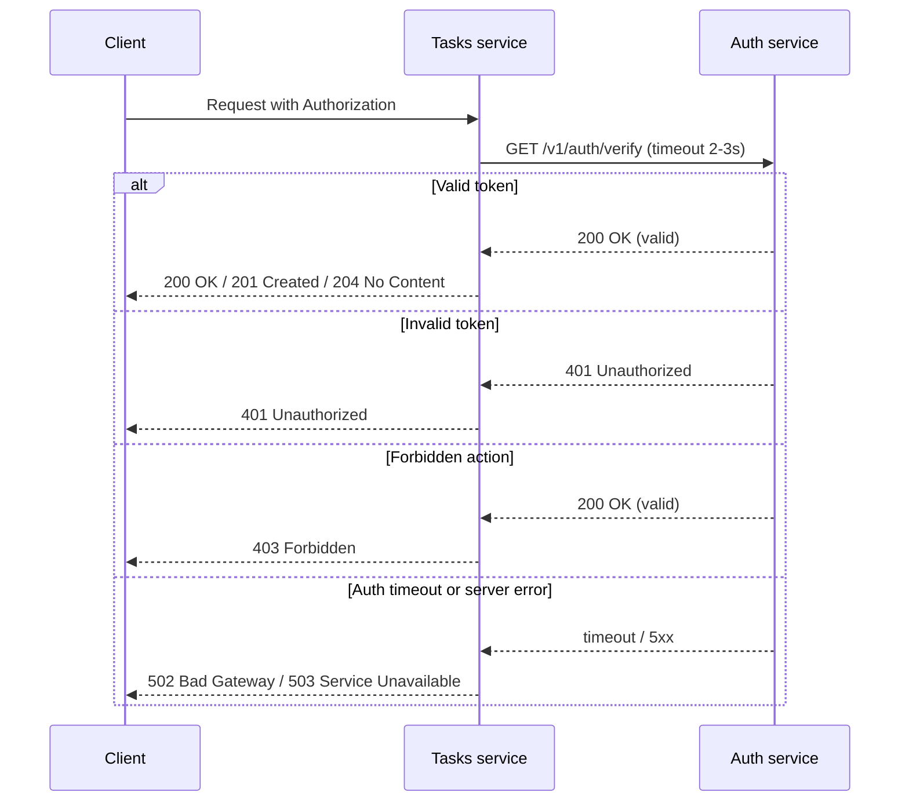

## Имя: Дорджиев Виктор
## Группа: ЭФМО-02-25
# ПЗ №1 — Микросервисы Auth + Tasks

## Цель
Научиться декомпозировать небольшую систему на два сервиса и
организовать корректное синхронное взаимодействие по HTTP (с
таймаутами, статусами ошибок и прокидыванием request-id)

В рамках ПЗ мы делаем учебную систему из двух компонентов:
1) Auth service — отвечает за “проверку доступа”
(упрощённая логика).
2) Tasks service — CRUD задач, но каждый запрос требует
проверки через Auth

## Установка и запуск

(Необходимы предустановленные Go версии 1.22 и выше и Git)

Клонировать репозиторий:

```
git clone <URL_РЕПОЗИТОРИЯ>
cd tech-ip-proto
```

Команда запуска сервера:

Терминал 1
```
go run ./services/auth/cmd/auth
```
Терминал 2
```
go run ./services/tasks/cmd/tasks
```

## Структура проекта
```plaintext
tech-ip-proto/
├── go.mod
├── go.sum
├── cmd/
│   ├── auth/
│   │   └── main.go
│   └── tasks/
│       └── main.go
├── internal/
│   ├── auth/
│   │   ├── service/
│   │   │   └── auth.go
│   │   └── http/
│   │       ├── router.go
│   │       └── handlers/
│   │           └── auth.go
│   ├── tasks/
│   │   ├── service/
│   │   │   └── tasks.go
│   │   ├── client/
│   │   │   └── authclient.go
│   │   └── http/
│   │       ├── router.go
│   │       └── handlers/
│   │           └── tasks.go
│   └── shared/
│       ├── httpx/
│       │   └── json.go
│       └── middleware/
│           ├── logging.go
│           └── requestid.go
├── docs/
│   ├── pz1_api.md
│   └── pz1_diagram.md
├── README.md
└── .gitignore
```

## Границы ответственности
Auth service
* выдаёт “токен” (упрощённо),
* проверяет токен,
* возвращает информацию: валиден/не валиден.

Tasks service
* хранит и управляет задачами,
* перед выполнением операций проверяет токен через Auth.

## Схема взаимодействия


## Список эндпоинтов (Auth и Tasks)

- Auth service
  - `POST /v1/auth/login`
  - `GET /v1/auth/verify`
- Tasks service
  - `POST /v1/tasks`
  - `GET /v1/tasks`
  - `GET /v1/tasks/{id}`
  - `PATCH /v1/tasks/{id}`
  - `DELETE /v1/tasks/{id}`


## Учётные данные для demo

- username: `student`
- password: `student`
- token: `demo-token`

## Скриншоты
### Скрин/лог с request-id, подтверждающий прокидывание.


### Получить токен

```
http://185.250.46.179:8081/v1/auth/login
```


### Проверка токена напрямую

```
http://185.250.46.179:8081/v1/auth/verify
```


### Создать задачу через Tasks (с проверкой Auth)

```
http://185.250.46.179:8082/v1/tasks
```


### Попробовать без токена (должно быть 401)

```
http://185.250.46.179:8082/v1/tasks
```


# Практическое занятие №2: gRPC verify между Auth и Tasks

## Что сделано

- Добавлен контракт `proto/auth.proto`
- Сгенерированы файлы:
  - `gen/auth/v1/auth.pb.go`
  - `gen/auth/v1/auth_grpc.pb.go`
- В `Auth` поднят gRPC сервер с методом `Verify`.
- В `Tasks` HTTP API сохранен, но проверка токена переведена на gRPC вызов в `Auth`.
- Для вызова из `Tasks` используется `deadline` 2 секунды.
- `request-id` прокидывается из HTTP в gRPC metadata.

## Контракт

```proto
syntax = "proto3";

package auth.v1;

option go_package = "example.com/tech-ip-proto/gen/auth/v1;authv1";

message VerifyRequest {
  string token = 1;
}

message VerifyResponse {
  bool valid = 1;
  string subject = 2;
}

service AuthService {
  rpc Verify(VerifyRequest) returns (VerifyResponse);
}
```

## Команды генерации

Использованные команды в PowerShell:

```powershell
$env:GOBIN = 'd:\ucheba\go\tech-ip-proto\.bin'
$env:GOCACHE = 'd:\ucheba\go\tech-ip-proto\.gocache'
$env:GOMODCACHE = 'd:\ucheba\go\tech-ip-proto\.gomodcache'
$env:GOSUMDB = 'off'

go install github.com/bufbuild/buf/cmd/buf@v1.39.0
go install google.golang.org/protobuf/cmd/protoc-gen-go@v1.36.3
go install google.golang.org/grpc/cmd/protoc-gen-go-grpc@v1.5.1

$env:PATH = 'd:\ucheba\go\tech-ip-proto\.bin;' + $env:PATH
$env:BUF_CACHE_DIR = 'd:\ucheba\go\tech-ip-proto\.bufcache'
$env:XDG_CACHE_HOME = 'd:\ucheba\go\tech-ip-proto\.cache'

.\.bin\buf.exe generate
```

Конфиги генерации:

- `buf.yaml`
- `buf.gen.yaml`

## Команды запуска

Auth:

```powershell
$env:AUTH_PORT = '8081'
$env:AUTH_GRPC_PORT = '50051'
go run ./services/auth/cmd/auth
```

Tasks:

```powershell
$env:TASKS_PORT = '8082'
$env:AUTH_GRPC_ADDR = 'localhost:50051'
go run ./services/tasks/cmd/tasks
```

## Маппинг ошибок

- `codes.Unauthenticated` из `Auth` -> HTTP `401 Unauthorized` в `Tasks`
- `codes.Unavailable` -> HTTP `502 Bad Gateway`
- `codes.DeadlineExceeded` -> HTTP `502 Bad Gateway`
- `codes.Internal` -> HTTP `502 Bad Gateway`
- неожиданные локальные ошибки клиента -> HTTP `500 Internal Server Error`

Выбранная политика для недоступного `Auth`: `502 Bad Gateway`.

## Проверка сценария

Проверенный сценарий:

1. `POST /v1/auth/login` -> получен токен `demo-token`
2. `POST /v1/tasks` с `Authorization: Bearer demo-token` -> `201 Created`
3. После остановки `Auth`: `GET /v1/tasks` с тем же токеном -> `502 Bad Gateway`

Пример логов успешного запроса:

```text
2026/03/13 20:53:37 service=tasks request_id=req-41300375728f11b9 calling grpc verify
2026/03/13 20:53:37 service=auth transport=grpc method=Verify request_id=req-41300375728f11b9 token_present=true
2026/03/13 20:53:37 service=tasks request_id=req-41300375728f11b9 method=POST path=/v1/tasks status=201 duration=10.6903ms
```

Пример логов при недоступном `Auth`:

```text
2026/03/13 20:53:38 service=tasks request_id=req-d4b5705d27571d57 calling grpc verify
2026/03/13 20:53:38 service=tasks request_id=req-d4b5705d27571d57 method=GET path=/v1/tasks status=502 duration=12.1169ms
```

## Контрольные вопросы

1. `.proto` — это описание сообщений и RPC-методов. Он считается контрактом, потому что одинаково задает формат данных и сигнатуры вызовов для клиента и сервера.
2. `deadline` в gRPC — это максимальное время на RPC-вызов. Он полезен тем, что не дает запросам зависать бесконечно и позволяет быстро вернуть понятную ошибку.
3. `exactly-once` не получается автоматически даже в RPC, потому что сеть может потерять ответ после фактического выполнения операции на сервере, и клиент не всегда знает, выполнилась она или нет.
4. Совместимость при расширении `.proto` обеспечивают добавлением новых полей с новыми номерами, отказом от переиспользования старых тегов и сохранением обратной совместимости сообщений и методов.